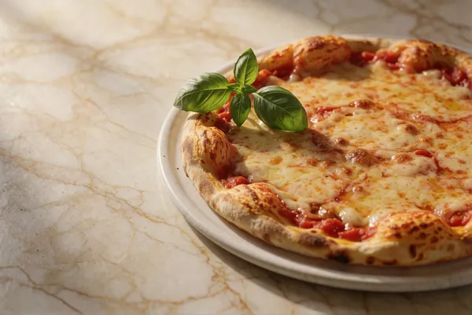

# Konzept: Bilder in die App einbauen

Stand: 2026-08-02 · App-Stand v4.34.0 · Grundlage für mehrere aufeinander folgende Zyklen

Dieses Dokument legt die **Mechanik** fest, mit der alle 128 Bild-Blöcke aus
`assets/BILD-PROMPTS.md` in die App kommen. Es entsteht bewusst **vor** dem ersten
Einbau-Zyklus, damit nicht jede Bildkategorie ihr eigenes Muster erfindet und später
alles umgebaut werden muss.

Es beschreibt **nicht**, wie die Bilder erzeugt werden (das steht in
`assets/BILD-PROMPTS.md` und `assets/SESSION-STATUS.md`).

---

## 1. Ausgangslage (gemessen, nicht geschätzt)

- **Die App hat heute genau einen echten Bild-Slot:** `--header-photo` in
  `css/styles.css` (Headerfoto). Dazu drei fest verdrahtete Pfade in `js/guide.js`
  (`FINAL_PHOTO`, Foto der fertigen Pizza).
- **118 von 128 Bildern liegen abgenommen in `assets/_final/`**, zusammen rund **18 MB**.
  Einzelne Dateien zwischen 59 KB und 527 KB.
- **Rund 10 Bilder fehlen noch** (Blöcke 77, 82, 83, 84 mit bekannten Problemen, 96 bis 98
  zurückgestellt, 118/119/124/126 offen). Das Konzept muss deshalb **teilweise befüllte
  Kategorien aushalten**, ohne kaputt auszusehen.
- **Aktiver Fehler im Repo:** die drei von `js/guide.js` referenzierten Dateien
  (`assets/pizza-final-neapolitanisch.jpg`, `-newyork.jpg`, `-teglia.jpg`) wurden nach
  `assets/_final/` verschoben und aus `assets/` gelöscht. Der Anleitungs-Abschluss zeigt
  damit aktuell ein **kaputtes Bild**. Muss im ersten Zyklus mit behoben werden.
- **Der Standalone-Build inlined Bilder als base64** (`build-mobile-standalone.py`,
  `inline_images()`, aktuell nur `pizza-final-*.jpg`). Die Datei liegt heute bei 663 KB.
  Mit allen Bildern würde daraus eine rund 25 MB große Einzeldatei.
- **Die Preset-Karten existieren schon als Markup**, aber nur drei Stück und rein textlich:
  `.preset-card` für „Schnell", „Klassisch", „Lang" (`pizza-rechner.html`), dahinter ein
  aufklappbares `<details>` mit dem vollständigen `#preset`-Dropdown (9 Rezepte).
  Bildmaterial existiert dagegen für **11 Karten** (Blöcke 8 bis 18), darunter
  `card-napoli_65.webp` für ein Preset, das es im Code gar nicht mehr gibt.

---

## 2. Die vier Schichten

### Schicht 1: Ein einziger app-seitiger Bildordner

`assets/_final/` ist heute die **Abnahme-Schleuse** des Bild-Workflows. Ein Ordnername mit
führendem Unterstrich, der „intern, noch nicht öffentlich" bedeutet, ist kein guter Ort,
aus dem die laufende App liest.

**Regel:** `assets/_final/` wird zu **`assets/img/`** umbenannt und ist ab dann der
app-seitige Bildordner. Der Erzeugungs-Workflow schreibt Entwürfe weiterhin nach
`assets/`, und „abgenommen" heißt weiterhin „nach `assets/img/` verschoben".

Damit gibt es **keine Kopie, keinen Sync-Schritt und keine doppelten 18 MB** im Repo.
Geändert werden muss nur die Wortwahl in `BILD-PROMPTS.md`, `SESSION-STATUS.md` und den
Python-Skripten.

### Schicht 2: Ein zentrales Bild-Register (`js/images.js`)

Neues Modul, früh in der Ladereihenfolge (nach `i18n`, vor `guide`/`glossary`/`presets`).
Es hält die **einzige** Zuordnung von logischem Schlüssel zu Datei:

```js
PZ.IMG = {
  'preset.napoli_klassisch': { file:'card-napoli_klassisch.webp', ratio:'3/2', alt:null },
  'guide.final.teglia':      { file:'pizza-final-teglia.jpg',     ratio:'16/9',
                               alt:'img.alt.guideFinal.teglia' },
  'glossar.hydration':       { file:'glossar-hydration.webp',     ratio:'3/2', alt:null,
                               pending:true },
  ...
};
```

- **Kein anderes Modul und keine HTML-Datei enthält je wieder einen Dateinamen.**
  Genau die Streuung fester Pfade hat den oben genannten aktiven Fehler erzeugt.
- `alt:null` heißt **dekorativ** (`alt=""`). Das ist der Regelfall: eine Preset-Karte
  trägt Name, Zeit und Eignung bereits als Text, ein beschreibender Alt-Text würde für
  Screenreader-Nutzer nur alles doppeln. Ein Alt-Text steht nur dort, wo das Bild
  **eigene** Information trägt.
- `pending:true` markiert noch nicht abgenommene Bilder.

`PZ.img(key)` liefert `null`, wenn der Schlüssel unbekannt oder `pending` ist. Aufrufer
rendern dann **gar nichts** statt eines kaputten Bildes. Das ist der Mechanismus, der es
erlaubt, eine Kategorie einzubauen, obwohl vier ihrer Bilder noch fehlen.

### Schicht 3: Ein einziger Markup-Baustein

`PZ.imgHtml(key, opts)` erzeugt für alle Kategorien dasselbe Muster:

```html
<span class="media media--3x2">
  
</span>
```

- `width`/`height` bzw. `aspect-ratio` aus dem Register: **kein Layout-Sprung** beim
  Nachladen, kein Ruckeln beim Scrollen.
- `loading="lazy"` überall außer beim Header/Hero (der ist sofort sichtbar).
- Dazu **ein** CSS-Block `.media` mit den Seitenverhältnis-Varianten, einmal definiert,
  von jeder Kategorie genutzt.
- Fehlt die Datei trotzdem, bleibt dank fester Box das Layout stabil.

### Schicht 4: Gewicht und der Standalone-Build

- Die Quelldateien sind für die Anzeigegröße **deutlich zu groß** (Karten werden mit rund
  150 bis 300 px Breite dargestellt, die Dateien haben 1500 px). Ein Aufbereitungsschritt
  (`assets/prepare_web_images.py`) erzeugt anzeigegerechte Fassungen. Zielmarke: die
  gesamte App unter rund 2 MB Bildlast, statt 18 MB.
- Der Standalone-Build kann **nicht** alle Bilder als base64 einbetten. Das ist die
  einzige offene Grundsatzentscheidung, s. Abschnitt 4.
- **Verbindliche Konvention seit v4.35.2 (nicht-destruktive Aufbereitung, gilt für ALLE
  künftigen Bild-Einbau-Zyklen):** `assets/prepare_web_images.py` skaliert NIE wieder in
  place. Jede Bildkategorie legt ihre in Erzeugungsauflösung abgenommene Fassung dauerhaft
  unter **`assets/originals/`** ab (das persistente Archiv, nicht zu verwechseln mit dem
  früheren `assets/_final/`, das als reine Abnahme-Schleuse VOR dem Wiring gedacht war und
  inzwischen zu `assets/img/` wurde, s. Schicht 1 oben). Das Skript liest ausschließlich
  aus `assets/originals/` und schreibt die skalierte Kopie nach `assets/img/`, die
  Originaldatei bleibt dabei immer unverändert. Ein Zyklus kann dadurch beliebig oft mit
  geänderter Zielgröße erneut laufen, ohne verlustiges Mehrfach-Re-Encodieren -- der Grund
  für diese Umstellung war ein realer Datenverlust (die 19 v4.35.0-Schrittbilder waren nur
  noch aus dem Git-Verlauf rekonstruierbar, weil die vorherige In-Place-Verkleinerung keine
  höher aufgelöste Fassung übrig ließ, s. `pizza-rechner-KONTEXT.md` v4.35.2). Für die vor
  dieser Umstellung bearbeiteten Kategorien (Karten, Pizza-Fotos, Texturen) existieren
  keine Originale mehr -- das ist bewusst nicht rückwirkend behoben (Aufwand/Nutzen, die
  hochaufgelösten Fassungen sind nicht mehr rekonstruierbar), gilt aber für jeden neuen
  Zyklus ab jetzt verbindlich.

---

## 3. Reihenfolge des Einbaus

Jede Kategorie ist ein eigener Zyklus über den Orchestrator (Markup plus CSS in Desktop
und Mobil, also klar kein Inline-Fix). Der erste Zyklus baut zusätzlich die Schichten 1
bis 3 auf, die folgenden nutzen sie nur noch.

| # | Kategorie | Blöcke | Aufwand | Status |
|---|-----------|--------|---------|--------|
| 1 | Preset-Karten **plus Grundgerüst** plus Fix des kaputten Anleitungsfotos | 8 bis 18 | groß (Fundament) | **erledigt (v4.32.0)** |
| 2 | Anleitungs-Schrittbilder | 27 bis 45 | mittel | **erledigt (v4.35.0)** |
| 3 | Glossar (Kategorie-Banner und Artikelbilder) | 46 bis 90 | mittel | **erledigt (v4.36.0 Banner, v4.37.0 Artikelbilder)**, s. Abschnitt 9 |
| 4 | Hero/Header (ersetzt das heutige Einzelfoto) | 1 bis 7 | klein | **teilweise (v4.38.0 Block 3 "teig-desktop", v4.38.2 Block 7 "teig-mobile")** |
| 5 | Onboarding, Party, Leerzustände | 91 bis 105 | mittel | offen |
| 6 | Texturen, Marketing, Varianten | 106 bis 128 | offen | **teilweise (v4.34.0)**, s. Abschnitt 7 |

---

## 4. Getroffene Entscheidungen (Nutzer, 2026-08-02, Punkt 1 revidiert am selben Tag)

1. **Revidiert (2026-08-02, am iPhone durchgefallen):** die ursprüngliche Fassung dieses
   Punkts sah vor, dass der Standalone-Build nur eine kleine, von Hand ausgewählte Menge
   Bilder einbettet. In der Praxis führte das dazu, dass die 9 neuen Preset-Kartenbilder
   NICHT in dieser Auswahl standen -- auf dem iPhone (wo die Standalone-Datei tatsächlich
   benutzt wird) blieb das komplette Kartengitter bildlos, ausgerechnet das Feature dieses
   Zyklus. Gemessene Zahlen zum Zeitpunkt der Revision: die 7 verdrahteten Kartendateien in
   `assets/img/` sind nach dem Verkleinern durch `assets/prepare_web_images.py` zusammen rund
   176 KB, base64 rund 235 KB. Die Standalone-Datei lag bei 1.033.502 Bytes, mit allen
   Kartenbildern bei rund 1,27 MB -- unproblematisch.

   **Neue Regel:** der Standalone-Build bettet **alle Bilder ein, die tatsächlich im
   Register (`js/images.js`, `PZ.IMG`) verdrahtet und nicht `pending` sind.** Das bleibt
   automatisch klein, weil pro Zyklus nur die Bilder verdrahtet werden, die die jeweilige
   Kategorie braucht, und `prepare_web_images.py` sie auf Anzeigegröße verkleinert. Nicht
   verdrahtete Bilder (aktuell über 100 Stück in `assets/img/`) werden weiterhin NICHT
   eingebettet. `build-mobile-standalone.py` liest dafür `js/images.js` direkt und leitet die
   Dateiliste daraus ab (`inline_image_files()`) -- es gibt bewusst **keine** zweite, von Hand
   gepflegte Aufzählung mehr, das war genau die Doppelpflege, die das Register eigentlich
   abschaffen sollte.

   **Warnschwelle:** wächst die Standalone-Datei durch künftige Zyklen auf über rund 3 MB,
   muss die Strategie neu bewertet werden. Die kommenden Kategorien bringen 19 Schrittbilder
   und 45 Glossarbilder mit, die zusammen deutlich mehr Gewicht haben können als die bisher
   10 eingebetteten Dateien (428 KB roh, Stand v4.32.1).

   **Nachtrag (v4.38.1, "Glossar-Artikelbilder im Standalone-Build"):** v4.37.0 war bei den
   33 Glossar-Artikelbildern versehentlich genau von dieser Regel abgewichen --
   `noStandalone:true` plus eine für `inline_image_files()` strukturell unsichtbare
   `forEach()`-Registrierung ließen die Bilder auf dem echten iPhone komplett fehlen (s.
   `pizza-rechner-KONTEXT.md`, Abschnitt „= aktueller Stand"). Korrigiert, indem
   `inline_image_files()` jetzt auch programmatisch registrierte Einträge erkennt und für
   genau diese 33 Dateien eine kleinere 600×400-Zweitfassung aus `assets/img_standalone/`
   einbettet (volle 1200×800-Auflösung hätte die Warnschwelle weit gerissen) -- die Regel
   selbst („alle registrierten, nicht-pending Bilder einbetten") bleibt unverändert gültig,
   auch für künftige Kategorien.
2. **Die Preset-Auswahl wird ein bebildertes Kartengitter über alle neun Rezepte.** Das
   heutige Dropdown im aufklappbaren `<details>` wird dadurch ersetzt. Jede Karte trägt
   Bild, Name, Zeitangabe und Eignung. Die bisherige Sonderrolle der drei Empfehlungen
   („Schnell", „Klassisch", „Lang") entfällt damit als eigenes Markup.
3. **Kein Schalter „Bilder anzeigen".** Bewusst nicht eingeführt, um den Umfang klein zu
   halten. Kann später nachgeholt werden, `PZ.FLAGS` existiert bereits.

Offen bleibt nur, was pro Kategorie-Zyklus ohnehin einzeln entschieden wird
(Auswahl der eingebetteten Bilder, konkrete Anzeigegrößen).

---

## 5. Design-System (erledigt am 2026-08-02)

Die maßgebliche Design-System-Beschreibung liegt seit 2026-08-02 im Repo unter
`design-import/DESIGNSYSTEM-TEIGMEISTER.md`. Der Ordner `design-import/` enthält das
System als Dateien (Tokens, Komponenten, Spezimen-Karten, Bildschirm-Nachbau). Derselbe
Stand liegt im Claude-Design-Projekt „Design System" des Nutzers, dorthin mit 44 Dateien
hochgeschoben. Details s. `pizza-rechner-KONTEXT.md`, Abschnitt „Design-System".

Für den Bild-Einbau wurden dort drei Dinge ergänzt, damit die Bildbehandlung **einmal**
festgelegt ist statt in jedem Zyklus neu in CSS erfunden zu werden:

- **`components/media/Media.jsx`** — die eine Bildbox. Legt die erlaubten
  Seitenverhältnisse fest (3:2 Karten und Glossar, 4:3 Anleitungsschritte, 16:9
  Fertig-Foto, 3:1 Glossar-Banner, 21:9 Desktop-Header, 4:5 Mobil-Header, 1:1 Texturen),
  reserviert die Fläche vor dem Laden, füllt sie währenddessen mit `--surface-2` statt
  Weiß, lädt alles außer dem Header verzögert und **rendert bei fehlender Datei gar
  nichts**.
- **`components/cards/PresetCard.jsx`** — um eine Bildvariante erweitert. Bild bündig an
  der Oberkante, dekorativ ausgezeichnet, weil Name, Zeit und Eignung darunter dasselbe
  bereits als Text sagen. Karten mit und ohne Bild dürfen im selben Gitter stehen.
- **`guidelines/imagery.card.html`** — Spezimen-Karte, die genau diese drei Fälle zeigt
  (feste Verhältnisse, Bild auf einer Karte, Karte ohne Bild).

Der Umsetzungs-Zyklus überträgt diese Spezifikation nach `css/styles.css` und
`js/images.js`, er erfindet sie nicht neu.

---

## 6. Zyklus 1: Ergebnis (v4.32.0, erledigt)

Alle vier Schichten wie oben beschrieben umgesetzt: `assets/img/` (Umbenennung von
`assets/_final/`), `js/images.js` (Register + `PZ.imgHtml()` + `PZ.hydrateImages()` für
statische Platzhalter), `.media`/`.media--<ratio>` in `css/styles.css` (alle 7 Verhältnisse
schon definiert, 3:2 und 16:9 in Benutzung), `assets/prepare_web_images.py` (Pillow, verkleinert
gezielt angebundene Dateien auf Anzeigegröße statt aller 128 auf einmal). Preset-Auswahl ist
jetzt ein 9-Karten-Gitter, das kaputte Anleitungsfoto ist behoben. Details, Testzahlen und
Commit-Hash: `pizza-rechner-KONTEXT.md`, Abschnitt „Bild-Grundgerüst plus bebildertes
Preset-Kartengitter (v4.32.0)".

Offene Nebenpunkte für spätere Zyklen: `assets/BILD-PROMPTS.md`/`assets/SESSION-STATUS.md`/
die Erzeugungs-Skripte (`generate_bilder.py` u. a.) sprechen noch von `assets/_final/` statt
`assets/img/` — bewusst nicht in diesem Zyklus mitgezogen (die laufende Bild-Erzeugungsarbeit
war explizit außerhalb des Auftrags), sollte aber vor der nächsten Erzeugungs-Sitzung
nachgezogen werden, sonst legt der Workflow versehentlich einen neuen `assets/_final/`-Ordner
an.

## 7. Zyklus 6 (Teil): Seitenhintergrund-Textur (v4.34.0, erledigt, v4.34.1 nachgebessert)

Vorgezogener Teilausschnitt aus Zyklus 6 („Texturen, Marketing, Varianten"): kein
Anzeige-Slot für ein einzelnes Bild, sondern eine zusätzliche Foto-Ebene im bestehenden
`--bg-gradient`-Token (`css/styles.css`), je Theme ein anderes stark weichgezeichnetes
Texturbild. Alpha-Werte mussten gegenüber der ursprünglichen Absicht deutlich gesenkt
werden, um WCAG 1.4.11 (3:1 gegen `--line`, worst-case über die gesamte Bildfläche) zu
erfüllen — der Nutzer fand das v4.34.0-Ergebnis live "unbrauchbar" (zu wenig Farbstimmung
übrig). v4.34.1 hat nachgebessert: Hell nutzt jetzt `texture-marmor.webp` statt
`texture-teighaut.webp` (Alpha 0,070 → 0,190, klarer Sprung), Dunkel bleibt
`texture-kruste.webp` mit einer neuen Lichter-Kompression (Alpha 0,110 → 0,150, nur
moderater Gewinn, ehrlich eingeordnet). Details, Testzahlen und Commit-Hash:
`pizza-rechner-KONTEXT-HISTORIE.md`, Abschnitte „Kontrastspielraum-Nachbesserung
Seitenhintergrund-Textur (v4.34.1)" und „Geblurrte Textur als Seitenhintergrund (v4.34.0)".
Restliche Blöcke 106-128 (Marketing/Varianten) weiterhin offen.

## 8. Zyklus 2: Anleitungs-Schrittbilder (v4.35.0, erledigt)

19 Schrittbilder (Blöcke 27-45) als randloses Bildband an der linken Kartenkante der
Anleitungsschritte (`js/guide.js` `.step__photo`, `opts.imgKey` je `st()`-Aufruf), plus
ein vom Nutzer mitbeauftragtes Redesign der Zusatzinhalte zu einem einzigen Aufklapper pro
Schritt. Neuer `opts.bare`-Modus in `PZ.imgHtml()` (kein `.media`-Box-Wrapper, da die
Bandhöhe dynamisch/kartenabhängig ist statt eines festen Seitenverhältnisses) — dabei ein
echter Chromium-Flexbox-Layout-Bug gefunden und behoben (width/height-HTML-Attribute
zusammen mit `align-self:stretch` bliesen die ganze Kartenzeile auf eine falsche,
inhaltsunabhängige Höhe auf). Details, Testzahlen und Commit-Hash:
`pizza-rechner-KONTEXT-HISTORIE.md`, Abschnitt „Anleitungs-Schrittbilder +
Ein-Aufklapper-Redesign (v4.35.0)".

**Nachbesserung v4.35.1 + vollständiger Fix v4.35.2:** die 300x224-Zielgröße aus v4.35.0
erwies sich als sichtbar unscharf (Nutzer-Meldung). v4.35.1 milderte das nur CSS-seitig
(Hochskalierungs-Deckel `PHOTO_MAX_UPSCALE`). v4.35.2 behebt die eigentliche Ursache: die
19 Originale (1200x896) wurden aus dem Git-Verlauf (Commit `c17acf7`) zurückgeholt, liegen
jetzt dauerhaft in `assets/originals/` (s. Schicht 4, neue nicht-destruktive Konvention)
und werden auf 600x448 statt 300x224 verkleinert (doppelte lineare Auflösung). Details:
`pizza-rechner-KONTEXT.md`, Abschnitt „= aktueller Stand".

## 9. Zyklus 3: Glossar-Kategorie-Banner (v4.36.0) + Artikelbilder (v4.37.0) — beides erledigt

**Teil 1 (v4.36.0, Kategorie-Banner):** die 7 Kategorie-Banner (3:1), eingebettet in das
Glossar-Kachelregal-Navigationskonzept (Regal aus Kacheln, betretene Kategorie mit
Bannerkopf). 6 der 7 Banner lagen bereits fertig in `assets/img/` (vor der v4.35.2-
Konvention erzeugt, kein Original mehr vorhanden), das 7. (`toppings`) wurde nach der
nicht-destruktiven Konvention nachgezogen (`assets/originals/`,
`assets/prepare_web_images.py`, 1496×496). Details, Testzahlen, Commit-Hash:
`pizza-rechner-KONTEXT-HISTORIE.md`, Abschnitt „Glossar-Kachelregal (v4.36.0)".

**Teil 2 (v4.37.0, Artikelbilder, "Bild-Einbau Zyklus 3, Rest"):** 33 von 38
Glossar-Artikeln bekommen jetzt ein 3:2-Bild oberhalb ihres Texts im aufgeklappten
`<details>` (Key-Schema `glossary.<id>`, `js/images.js`). 5 Ausnahmen: `biga`/
`belagCapricciosa` haben kein fertiges Bild in `assets/img/` (nur lose Arbeitsstände
direkt unter `assets/`, außerhalb des Scopes), `belagNachDemBacken`/
`belagQuattroFormaggi`/`sfincione` haben eine fertige Datei, wurden aber vom Nutzer
während dieses Zyklus per Direktanweisung nicht freigegeben (`GLOSSARY_ARTICLE_BLOCKLIST`
in `js/images.js`, Selbsttest wirft bei Widerspruch zur Positivliste).

**Abweichung von der Standalone-Regel aus Abschnitt 4 (in v4.38.1 korrigiert, s. dortiger
Nachtrag):** alle 33 Dateien sind 1200×800 (kein Original mehr vorhanden, deshalb NICHT
destruktiv verkleinert, s. `pizza-rechner-KONTEXT.md` für die ehrliche Einordnung) und
liegen zusammen roh bei über 3 MB, base64 über 4 MB — eingebettet hätte das den
Standalone-Build weit über die ~3-MB-Warnschwelle getrieben. Alle 33 Einträge trugen
deshalb `noStandalone:true`; `build-mobile-standalone.py` (`inline_image_files()`) ließ sie
aus, auf `pizza-rechner.html`/`-mobile.html` (Web) blieben sie unverändert sichtbar.
Standalone-Datei nach dem Rebuild: 39 eingebettete Bilder (unverändert gegenüber v4.36.0),
~2,86 MB (vorher ~2,84 MB — die Differenz kommt ausschließlich vom mitinlinierten
JS-Quelltext, nicht von neuen Bildern). **Auf dem echten iPhone fehlten dadurch alle 33
Bilder komplett** — v4.38.1 hat das korrigiert (kleinere 600×400-Zweitfassung nur fürs
Embedding, s. Abschnitt 4 Nachtrag).

2 der 33 Bilder (`napoletanaVsRomana`, `windowpane`) bekamen nach einem
`accessibility-expert`-Review einen beschreibenden statt dekorativen Alt-Text (WCAG
1.1.1) — beide zeigen die fachliche Kerninformation des Artikels selbst (Krustenform-
Vergleich bzw. Windowpane-Idealzustand), nicht nur eine Illustration. Details, Testzahlen
und Commit-Hash: `pizza-rechner-KONTEXT-HISTORIE.md`, Abschnitt „Glossar-Artikelbilder
(v4.37.0)".

## 10. Zyklus 4 (Teil): Hero/Header (v4.38.0 Block 3, v4.38.2 Block 7) — Blöcke 3+7 erledigt, Rest offen

`--header-photo` in `css/styles.css` zeigt seit v4.38.0 `assets/img/header-teig-desktop.webp`
(Block 3 "header-teig-desktop", 21:9) statt des bisherigen `assets/header-pizza.jpg`.
Bildwahl aus 4 bereits in einer früheren Sitzung generierten Varianten
(`assets/alt-header-teig-desktop_v1..v4.webp`): eigener Check gegen die Prompt-Vorgabe
("keine Ritzungen, Kerben, Falten, Nähte" auf der Teigkuppe) zeigte bei Varianten 3 und 4
eine sichtbare Naht, dem Nutzer deshalb nicht empfohlen. Nutzer wählte Variante 1.
Einbau nicht-destruktiv (Pass-Through-Eintrag in `assets/prepare_web_images.py`, analog
`glossar-cat-toppings.webp`), Kontrast per Live-Canvas-Messung gegen die echten Titel-
Koordinaten und die tatsächliche Overlay-Deckkraft (`rgba(20,9,5,.62)`, nicht der im
`HEADER-FOTO-README.txt` dokumentierte veraltete Wert 0,55) geprüft: 6,27:1 Desktop
(1265×142), 5,59:1 Mobil (390×90, damals noch dasselbe Bild wie Desktop), beide über der
3:1-Großtext-Schwelle.

**Block 7 (eigener Mobil-Header, v4.38.2):** Mobil zeigt jetzt ein eigenes 4:5-Hochformat
(`assets/img/header-teig-mobile.webp`, Motiv "Hand zieht Teig") statt des bis dahin
geteilten Desktop-Bilds — Umsetzung über einen neuen `:root`-Override in `css/mobile.css`
(lädt nach `css/styles.css`, kein Media-Query nötig, Desktop bindet `css/mobile.css` gar
nicht ein). Bildwahl aus 4 generierten Varianten, Nutzer wählte Variante 1 nach Sichtung per
Kontaktbogen. Moderate Verkleinerung auf 1200×1495 (statt reinem Pass-Through wie bei
Block 3), Begründung in `assets/prepare_web_images.py`. Kontrast erneut geprüft (zwei
unabhängige Methoden): ca. 5,76-5,83:1, weiterhin klar über der 3:1-Schwelle. Details,
Testzahlen und Commit-Hash: `pizza-rechner-KONTEXT.md`, Abschnitt „= aktueller Stand".

**Die restlichen 5 Blöcke bleiben offen:** die 4 übrigen Desktop-Konzepte (Margherita,
Menschen, Abend, Mehl) und Block 2 (weiterer Mobil-Header-Entwurf, nicht gewählt) sind
weder generiert noch eingebaut (Margherita/Menschen/Abend/Mehl noch nicht generiert; die
4 Mobil-Varianten aus Block 7 wurden bereits generiert, 3 davon bleiben ungenutzt liegen).
Varianten 2 bis 4 von Block 3 und Block 7 bleiben als Dateien liegen (keine Löschung),
werden aber nicht verwendet. Details, Testzahlen und Commit-Hash zu Block 3:
`pizza-rechner-KONTEXT-HISTORIE.md`, Abschnitt „Header-Bild ausgetauscht (v4.38.0)".
